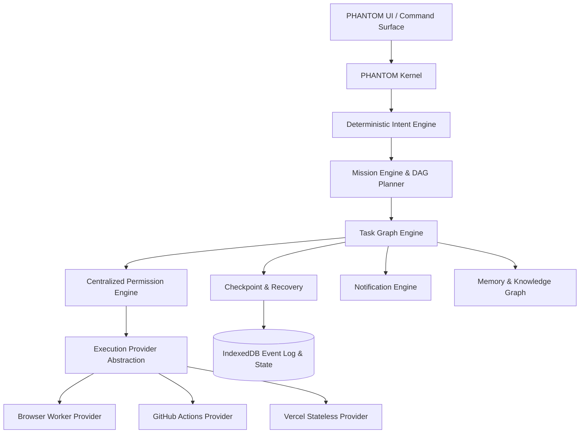

# PHANTOM AI Architecture Specification

## System Components

1. **PHANTOM Kernel (`src/kernel/PhantomKernel.ts`)**
   - Central state coordinator and operational dispatch.
   - Evaluates commands for conversational intent vs. mission objectives.
   - Schedules tasks to available execution providers.

2. **Intent Engine (`src/kernel/IntentEngine.ts`)**
   - Deterministic keyword, grammar, and regex parser.
   - Understands English, Hindi, and Hinglish dialogue.
   - Disambiguates greetings and queries from operational task graphs.

3. **Mission & Task DAG Engine (`src/kernel/MissionEngine.ts`)**
   - Directed Acyclic Graph (DAG) construction with dependencies.
   - Handles timeout, retry backoff policies, and checkpointing.

4. **Permission Engine (`src/kernel/PermissionEngine.ts`)**
   - Centralized enforcement of capability permissions (`ALLOW`, `ASK`, `DENY`).
   - Immutable boundaries preventing security breaches, malware, and credential theft.

5. **Universal Data & Research Engines (`src/kernel/ResearchEngine.ts`)**
   - Web discovery, citation verification, entity extraction, and markdown dossier compilation.
   - CSV/XLSX statistical processing and anomaly detection.
